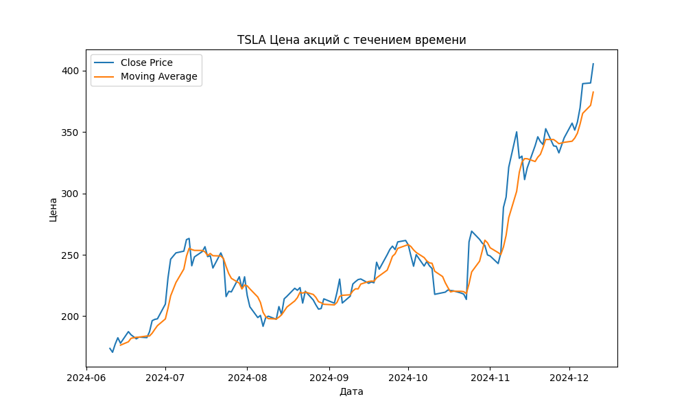

# **Структура и модули проекта**

## main.py:
- Является точкой входа в программу.
- Запрашивает у пользователя тикер акции и временной период, загружает данные, обрабатывает их и выводит результаты в виде графика.

## data_download.py:
- Отвечает за загрузку данных об акциях.
- Содержит функции для извлечения данных об акциях из интернета и расчёта скользящего среднего.
- Функция расчета средней цены закрытия акций за период
- Функция расчета колебания цены за период

## data_plotting.py:
- Отвечает за визуализацию данных.
- Содержит функции для создания и сохранения графиков цен закрытия и скользящих средних.

## Примеры работы кода

- Запрос пользователя акций Tesla Inc за 6 месяцев.
- Вывод средней цены закрытия акций за период.
- Уведомление о колебаниях.

- График цен акций Tesla Inc за 6 месяцев

